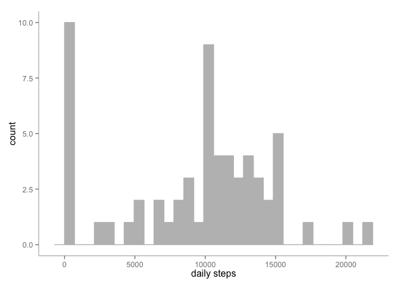
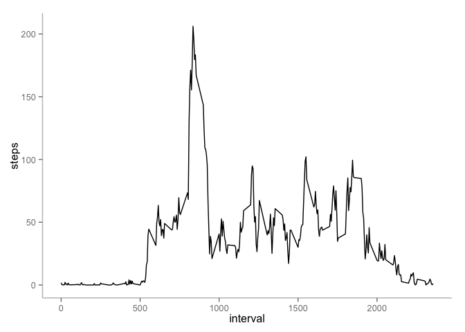
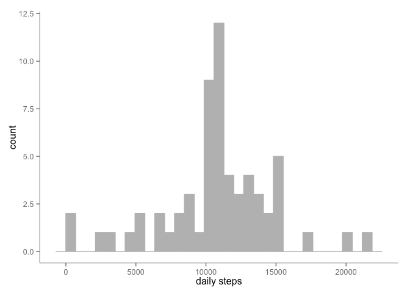
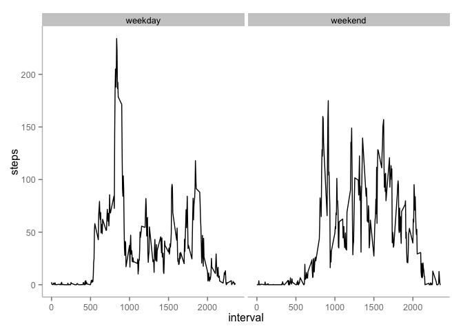

# Reproducible Research: Peer Assessment 1

### Loading and preprocessing the data

```r
# Load the required packages
library(dplyr)
library(ggplot2)

# Load the data
df.activity <- read.csv("activity.csv")
```

### What is mean total number of steps taken per day?\

Set up the data and create the histogram.

```r
# Make a data frame of the total number of steps taken per day
by_day <- group_by(df.activity, date)
df.dailySteps <- summarise(by_day, steps = sum(steps, na.rm = TRUE))

# Make a histogram of steps taken per day 
ggplot(data = df.dailySteps, aes(x = steps)) +
  geom_histogram(fill = "gray", color = "gray") +
    xlab("daily steps") +
  theme(panel.grid.major = element_blank(), panel.grid.minor = element_blank(), 
        panel.background = element_blank(), axis.line = element_line(colour = "gray"))
```

```
## stat_bin: binwidth defaulted to range/30. Use 'binwidth = x' to adjust this.
```

 

Find the mean and median.

```r
# Report the mean and median of steps taken per day
mean.steps <- mean(df.dailySteps$steps, na.rm = TRUE)
median.steps <- median(df.dailySteps$steps, na.rm = TRUE)
```

The mean is 9354 and the median is 10395.

### What is the average daily activity pattern?
Set up the data and create the time series plot for average daily steps.

```r
# Create a data frame of the average daily activity
by_interval <- group_by(df.activity, interval)
df.intervalSteps <- summarise(by_interval, steps = mean(steps, na.rm = TRUE))

# Make a time series plot
ggplot(df.intervalSteps, aes(interval, steps)) + geom_line() + 
  theme(panel.grid.major = element_blank(), panel.grid.minor = element_blank(), 
              panel.background = element_blank(), axis.line = element_line(colour = "gray"))
```

 

Find the position of the max number of steps and take that row.

```r
# Find the interval with the max number of steps
maxPos <- which.max(df.intervalSteps$steps)
maxRow <- df.intervalSteps[maxPos, ]
```
The interval with the maximum number of steps is 835 and the number of steps is 206.

### Imputing missing values
Count the number of rows with missing values. Replace these missing values with the interval average across all days. Create a histogram of this new data.

```r
# Count number of rows with NA values
missingCount <- sum(is.na(df.activity))

# Fill in the missing data with the interval average
df.activityFill <- df.activity

for (i in 1:nrow(df.activity)) {
  if (any(is.na(df.activity[i,]) == TRUE)) {
    df.activityFill[i, 1] <- df.intervalSteps$steps[match(df.activity[i, 3],
                                                          df.intervalSteps$interval)]
  }
}

# Make a data frame of the total number of steps taken per day
by_day <- group_by(df.activityFill, date)
df.dailyStepsFill <- summarise(by_day, steps = sum(steps, na.rm = TRUE))

# Make a histogram of this new data set
ggplot(data = df.dailyStepsFill, aes(x = steps)) +
  geom_histogram(fill = "gray", color = "gray") +
  xlab("daily steps") +
  theme(panel.grid.major = element_blank(), panel.grid.minor = element_blank(), 
        panel.background = element_blank(), axis.line = element_line(colour = "gray"))
```

```
## stat_bin: binwidth defaulted to range/30. Use 'binwidth = x' to adjust this.
```

 

Find the mean and median of this new data to compare it to the orginial data.

```r
# Report the mean and median of steps taken per day
mean.stepsFill <- mean(df.dailyStepsFill$steps, na.rm = TRUE)
median.stepsFill <- median(df.dailyStepsFill$steps, na.rm = TRUE)
```
The new mean is 10766 and the new median is 10766. Not only are the new mean and median now equal as a result of this imputed data, they are both higher than the original mean, 9354, and median, 10395.

### Are there differences in activity patterns between weekdays and weekends?
Create a factor variable to split the average daily steps by weekday and weekend.

```r
# Create a weekday/weekend factor variable
df.activityFactor <- df.activity
df.activityFactor$date <- as.Date(df.activityFactor$date)
df.activityFactor$day <- weekdays(df.activityFactor$date)

df.activityFactor$daytype <- as.factor(
                                ifelse(df.activityFactor$day %in% c("Saturday","Sunday"),
                                       "weekend", "weekday"))

# Average daily activity
by_interval <- group_by(df.activityFactor, daytype, interval)
df.intervalStepsFactor <- summarise(by_interval, steps = mean(steps, na.rm = TRUE))
```

Create the plot.

```r
# Make a time series plot
ggplot(df.intervalStepsFactor, aes(interval, steps)) + geom_line() + 
  theme(panel.grid.major = element_blank(), panel.grid.minor = element_blank(), 
        panel.background = element_blank(), axis.line = element_line(colour = "gray")) +
  facet_wrap(~daytype, nrow=1)
```

 
